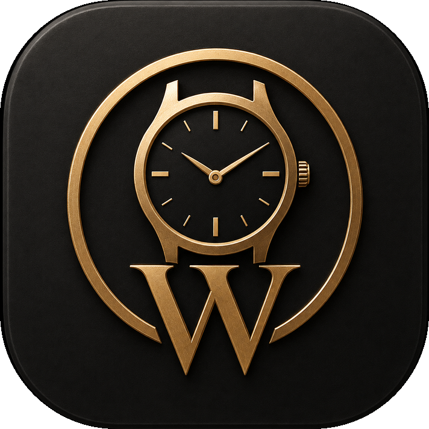

<p align="center">
  
</p>

<h1 align="center">WatchVault</h1>

An offline-first, personal wristwatch collection and wishlist app for Android. Kotlin +
Jetpack Compose + Material 3, single-module app, Room database, no cloud sync, no account,
no ads.

<p align="center">
  <a href="https://github.com/Periasamy147/WatchVault/releases/latest/download/WatchVault-latest.apk">
    
  </a>
</p>

<p align="center"><b><a href="https://github.com/Periasamy147/WatchVault/releases/latest">⬇️ Download the latest APK from Releases</a></b> — no account, no cloud, install directly.</p>

### Installing the APK

1. Download `WatchVault-latest.apk` from the badge/link above.
2. Your browser or file manager will ask to allow installing unknown apps for itself — allow it once.
3. Android Play Protect will likely show an "unrecognized developer" warning before install. This is
   expected and not a defect: it appears for any APK not distributed through the Play Store,
   regardless of how it's built or signed. Tap "Install anyway"/"More details → Install anyway" to
   proceed. The app itself needs no permissions beyond INTERNET (used only for optional URL import).

### Performance

- Requests the display's highest available refresh rate (90Hz/120Hz panels) at startup instead of
  the OS default of 60Hz.
- All scrollable lists (Collection, Wishlist, Activity) use stable per-item keys, so scrolling and
  list edits don't force full-list recomposition.
- Hardware acceleration is explicit in the manifest (also the platform default).

## Status

This project was written source-first in a sandbox with **no Android SDK and no Gradle
installed**, so it has **not been compiled or run here**. It should build cleanly in
Android Studio (Hedgehog or newer) once you point it at a real SDK, but treat that as
"should" until you've actually opened it. Two things need one manual step first:

1. `gradle/wrapper/gradle-wrapper.jar` is not included (it's a binary file and this
   environment had no way to produce a real one). Android Studio will offer to regenerate
   it automatically on first open, or run `gradle wrapper --gradle-version 8.7` yourself
   once you have a system Gradle available.
2. First build will need network access to resolve dependencies from Google's and Maven
   Central's repositories.

## Download

No build tools needed — grab the latest signed APK from the
[Releases page](https://github.com/Periasamy147/WatchVault/releases) and install it
directly (enable "install from unknown sources" for your browser/file manager). No
account, no cloud, no network access required to run the app itself.

## Releases (CI)

Two workflows, split by branch, so only intentional releases produce an APK:

- **`production` branch** (`.github/workflows/release.yml`) — on every push, CI builds a
  signed release APK with Gradle, runs the unit tests, and publishes a GitHub Release
  tagged from `versionName` in `app/build.gradle.kts` (e.g. `v1.0.0`) with the APK attached
  as a downloadable asset. Nothing else triggers a release.
- **Every other branch / PR** (`.github/workflows/ci.yml`) — build + unit tests only
  (`assembleDebug`, `testDebugUnitTest`). No APK is produced, nothing is published.

To cut a new release: bump `versionCode`/`versionName` in `app/build.gradle.kts`, merge
into `production`, and CI does the rest.

The release APK is signed with a keystore generated fresh inside each CI run (self-signed,
good enough to install — it doesn't assert developer identity the way a Play Store
listing would). Bring your own keystore later by setting the `RELEASE_KEYSTORE_PATH`,
`RELEASE_KEYSTORE_PASSWORD`, `RELEASE_KEY_ALIAS`, and `RELEASE_KEY_PASSWORD` repo secrets
and committing that step instead — `app/build.gradle.kts` already reads those env vars and
falls back to debug signing locally when no keystore is present.

## Build

- Android Studio Hedgehog (2023.1.1) or newer
- Android SDK Platform 34, Build Tools matching AGP 8.5.x
- JDK 17 (project targets Java 17 bytecode)

Open the project root in Android Studio and let it sync, or from a machine with Gradle:

```
./gradlew assembleDebug
./gradlew testDebugUnitTest
```

## Architecture

- **data/entity, data/dao, data/db, data/relation** — Room schema (Phase 1, unchanged from
  the original design). See `docs/PHASE1_SCHEMA_DESIGN.md`.
- **data/repository** — one repository per feature area (`WatchRepository`,
  `WishlistRepository`, `MaintenanceRepository`, `BackupRepository`), each wrapping DAOs
  behind suspend/Flow APIs.
- **data/migration** — `MyInnosImporter` (legacy backup → Watch Vault entities) and
  `WishToOwnedConverter` (wishlist → owned watch), both from Phase 1, unchanged.
- **data/importexport** — `BackupFormat` (Phase 1, unchanged) plus `EntityJson.kt`, a hand
  -written JSON adapter layer that maps Room entities to/from the backup ZIP's flat JSON
  files without touching the entities themselves.
- **data/urlimport** — `UrlImportPipeline` (Phase 1, unchanged) plus a real implementation:
  `OkHttpUrlFetcher` for the network call and four extractors (`JsonLdExtractor`,
  `OpenGraphExtractor`, `MetaTagExtractor`, `HtmlHeuristicExtractor`) built on Jsoup.
- **di** — `AppContainer`, a plain hand-rolled service locator held on the `Application`
  instance (no Hilt/Dagger — the app is small enough that manual wiring stays readable).
- **ui** — Compose screens, one package per feature, each with its own ViewModel
  (`viewModelScope` + `StateFlow`). Navigation via `androidx.navigation:navigation-compose`.

## Database schema (Phase 1, summary)

Room database `watch_vault.db`, version 1, `exportSchema = true`. Tables: `watches`,
`watch_photos`, `wishlist_items`, `maintenance_records`, `accuracy_records`, `wear_records`,
`price_records`, `documents`, `tags`, `watch_tag_cross_ref`, `import_jobs`, `export_jobs`,
`settings`. Full field-by-field rationale is in `docs/PHASE1_SCHEMA_DESIGN.md`; the load
-bearing rules carried through the whole app:

- `box`/`papers` are separate nullable columns on `Watch`, never inferred from the legacy
  MyInnos `hasBoxPapers` combined flag (`hasBoxPapersLegacy` keeps that original value for
  audit). The UI shows "Unknown" until the user explicitly confirms each one.
- `purchaseCurrency`/`estimatedValueCurrency` default to `"INR"` on MyInnos import with
  `purchaseCurrencyAssumed = true` — the UI labels this "(assumed)", never as fact.
- Conflicting market-value data found across `watches.json` and external research files
  is never auto-resolved: the canonical `estimatedValue` from the export stays untouched,
  and every conflicting value is logged as a `PriceRecord(isCanonical = false,
  conflictStatus = "conflicting_not_applied")` for the user to review.
- `movementType`/`condition` are kept as free text (`movementRaw`/`conditionRaw`); the raw
  string is never discarded even after normalization.
- `legacyData` on `Watch` holds the entire original MyInnos JSON object for that watch,
  verbatim, so nothing from the old app is ever unrecoverable.

## Theming

`ui/theme/Theme.kt` exposes `WatchVaultTheme`, called once from `MainActivity` with the
current `ThemeSettings` collected as Compose state from `ThemePreferencesRepository`
(DataStore Preferences). Because the `ColorScheme` is recomputed on every recomposition
from that state, any change on the Settings screen restyles the whole app immediately.

- **Dynamic color (Material You)**: on Android 12+, toggling it on calls
  `dynamicLightColorScheme`/`dynamicDarkColorScheme` against the device wallpaper palette.
- **Seed color**: used whenever dynamic color is off or unsupported. Eight Pixel-style
  swatches (Blue, Green, Purple, Orange, Red, Teal, Pink, Slate) each expand into a full
  light/dark `ColorScheme` via a lightweight blend-toward-white/black tonal approximation
  (`schemeFromSeed` in `Theme.kt`) rather than a full Material color-utilities palette
  generator, to avoid an extra dependency.
- **Mode**: Light / Dark / System, also persisted.

All three choices persist in DataStore and survive process death/restart.

## URL import

`UrlImportPipeline` runs four extractors in order — JSON-LD, OpenGraph, meta tags, then a
conservative HTML heuristic fallback — each filling only the gaps the previous ones left.
Every field carries its source (`JSON_LD` / `OPEN_GRAPH` / `META_TAG` / `HTML_TABLE`) and a
confidence flag. Nothing reaches the database until the user reviews the field-by-field
preview and taps "Apply to form" on the Wishlist add/edit screen — scraped data is never
silently saved.

### Adding a site-specific adapter later

Implement `SiteAdapter` (domain + a `refine(existing, html)` function that can override or
add fields the generic extractors missed) and register it in the `siteAdapters` map passed
into `UrlImportPipeline` inside `AppContainer.urlImportPipeline`. A missing or broken
adapter must never block extraction — the pipeline already works with zero adapters
registered, so adapters are purely additive.

## Implemented

- Room database + full repository/ViewModel layer, manual DI via `AppContainer`
- Home, Collection (grid/list, search, sort, filter), Watch Detail (expandable sections),
  Add/Edit Watch, Wishlist, Add/Edit Wishlist Item with "Add from URL", Wish→Owned
  conversion, Import/Export (MyInnos import, Watch Vault backup restore + export),
  Settings (theme + About)
- Material 3 dynamic color with static seed-color fallback, persisted via DataStore,
  live-applied
- Generic URL import pipeline (JSON-LD/OpenGraph/meta/heuristic) with mandatory preview
- Full-backup ZIP export/restore per `BackupFormat`, with SHA-256 checksum verification
  before restore and a single Room transaction so a corrupt ZIP can't half-apply
- Original Pixel-style adaptive launcher icon (vector, with a themed monochrome variant)
- `MyInnosImportRoundTripTest` (Phase 1, unchanged) plus new plain-JVM/Robolectric Room DAO
  tests

## Explicitly deferred (not built in this pass)

- CSV/XLSX bulk import
- Site-specific URL adapters (Amazon, Timex, etc. — the generic pipeline works without them)
- Charts/analytics dashboard
- PIN/biometric app lock
- Encrypted database
- Wear-history calendar UI (the `WearRecord` entity and DAO exist; no screen yet)
- Accuracy-tracking UI (the `AccuracyRecord` entity exists; no screen yet)
- Tags UI (the `Tag`/`WatchTagCrossRef` entities exist; no screen yet)
- Currency conversion
